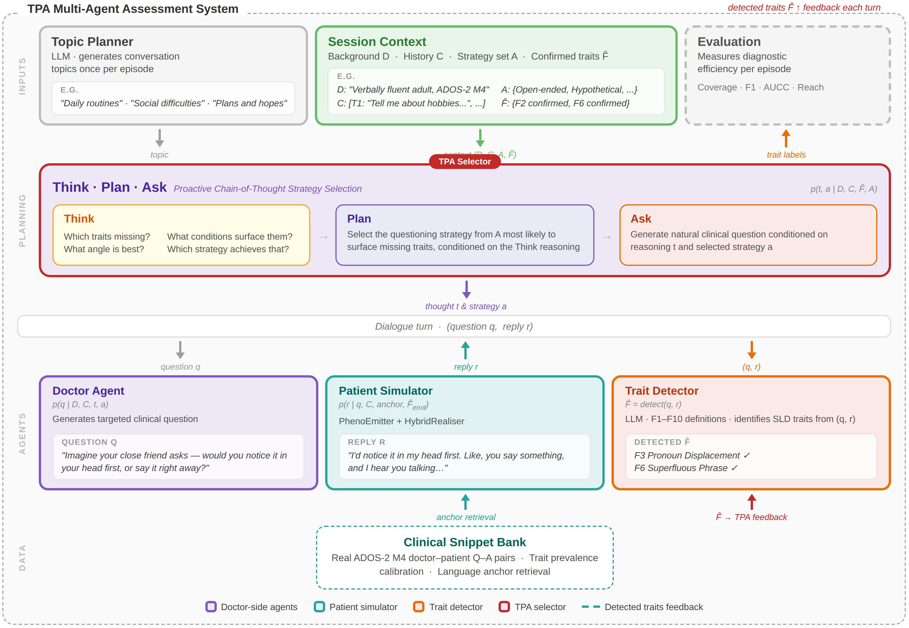
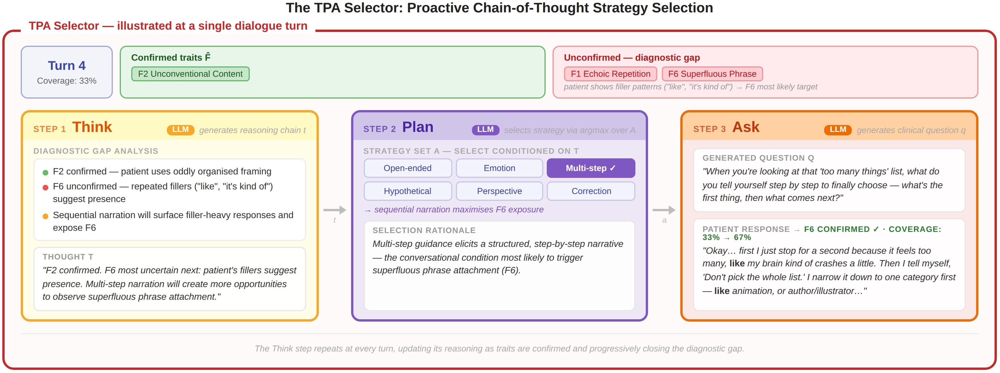
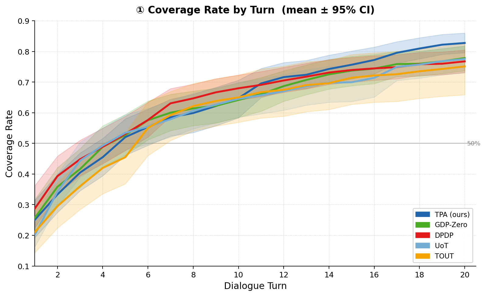
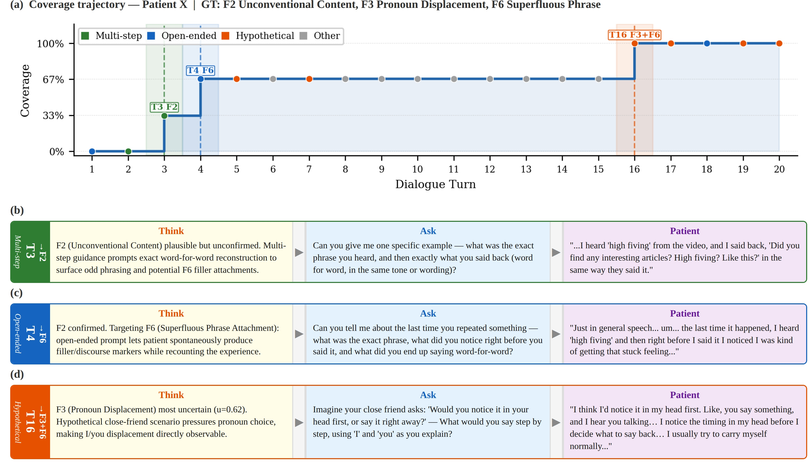

# A Proactive Multi-Agent Dialogue Framework for Assessing Social Language Disorder Traits in Autism

This repository contains the datasets, prompts, and supplementary materials for the paper:  
**"A Proactive Multi-Agent Dialogue Framework for Assessing Social Language Disorder Traits in Autism"**  
by **Chuanbo Hu, Minglei Yin, Bin Liu, Wenqi Li, Lynn K. Paul, Shuo Wang, and Xin Li**.

---

## Abstract

Social Language Disorder (SLD) traits in autism spectrum disorder, characteristic linguistic behaviours including echoic repetition, pronoun displacement, and stereotyped media quoting, are largely absent from spontaneous conversation and only emerge under specific conversational conditions. In structured clinical assessments, this latency means that questioning strategy selection is a critical yet underappreciated determinant of how much diagnostic information a conversation yields. Whether large language models can be guided to proactively select questioning strategies that systematically surface these latent traits remains largely unexplored. Here we present TPA (Think, Plan, Ask), a proactive multi-agent dialogue framework applied to the language assessment component of the Autism Diagnostic Observation Schedule Module 4 (ADOS-2), in which a doctor agent explicitly reasons about which traits remain unobserved before selecting a clinically grounded strategy and generating a targeted question. A patient agent grounded in real ADOS-2 clinical data enables reproducible evaluation without real patient participation, validated across three independent experiments confirming adequate fidelity to real patient language. Evaluated on 35 patients, TPA outperforms six competitive dialogue planning baselines across all primary metrics, achieving 82.1\% SLD trait coverage. Compared with automated replay of real clinical dialogues conducted by trained clinicians, and TPA elicits 37\% more trait coverage per dialogue turn (AUCC: 0.458 VS. 0.628). These results demonstrate that proactive questioning strategy selection substantially improves the efficiency of automated SLD trait assessment, with direct implications for scalable AI-assisted clinical screening.

---

## Multi-agent Framework



---

## TPA Selector



---
## Dataset

The sample dataset is available for download at the following link:  
[Download Dataset](https://drive.google.com/file/d/1F2o6guOh8REwJCJ9nXpgGZ04LKW-VDbZ/view?usp=sharing)  

Additional data may be added in the future.   

---
## Results




## Case Study



---
## Requirements

**Python**: 3.9+

Install dependencies:

```bash
pip install langchain-openai pyautogen numpy sentence-transformers tqdm
```

**Environment variable** (required before running):

```bash
export OPENAI_API_KEY="your-key-here"
```

---

## Running the Pipeline

### Run all five modes (default)

```bash
python multi_agent_system_autism.py
```

### Run specific modes

```bash
python multi_agent_system_autism.py --modes procot proactive standard
```

### Full CLI options

```
--modes         Subset of modes to run (default: all five)
                choices: procot, proactive, standard, random, round_robin
--max-turns     Maximum dialogue turns per episode (default: 20)
--no-early-stop Disable early stopping based on belief uncertainty
--log-dir       Output directory for logs and summaries (default: logs_procot)
```

Example:

```bash
python multi_agent_system_autism.py \
    --modes procot standard \
    --max-turns 15 \
    --log-dir my_experiment
```

---

## Citation
If you use our data or prompts in your research, please cite our paper:
```text
@article{hu2024exploiting,
  title={Exploiting ChatGPT for Diagnosing Autism-Associated Language Disorders and Identifying Distinct Features},
  author={Hu, Chuanbo and Li, Wenqi and Ruan, Mindi and Yu, Xiangxu and Paul, Lynn K and Wang, Shuo and Li, Xin},
  journal={arXiv preprint arXiv:2405.01799},
  year={2024}
}
```
